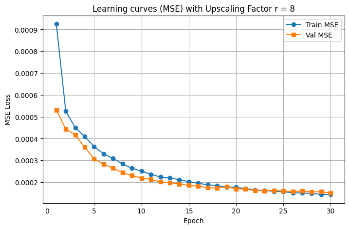

# AFiLM: Self-Attention for Audio Super-resolution (PyTorch Implementation)

[](https://arxiv.org/abs/2108.11637)
[](https://ieeexplore.ieee.org/abstract/document/9596082)

This repository contains a **PyTorch implementation** of the AFiLM (Audio Feature-wise Linear Modulation with Self-Attention) model for audio super-resolution, originally implemented in TensorFlow/Keras.

##  Key Features

- **Full PyTorch conversion** from the original TensorFlow implementation
- **Self-attention mechanism** for improved audio super-resolution
- **Multi-scale support** (2x, 4x, 8x upsampling)
- **Comprehensive training curves** and evaluation metrics
- **Pre-trained models** available for download
- **Multi-dataset support** (VCTK and LibriSpeech)

##  Requirements

- Python 3.8+
- PyTorch = 2.8.0
- torchaudio
- numpy
- scipy
- h5py
- matplotlib (for visualization)

```bash
pip install torch torchaudio numpy scipy h5py matplotlib
```

##  Training Results

The model was trained on multiple datasets with different upsampling factors. Below are the training curves showing both MSE and RMSE metrics:

### VCTK Single Dataset

#### Scale Factor r=2


#### Scale Factor r=4


#### Scale Factor r=8



### LibriSpeech Single Dataset

#### Scale Factor r=2


#### Scale Factor r=4


#### Scale Factor r=8


##  Pre-trained Models

### VCTK Single Speaker

| Scale | Dataset | Download Link |
|-------|---------|---------------|
| 2x | VCTK Single | [Download](https://drive.google.com/file/d/1x53LolK_uGTExHa6qLAdDt2EgNhMGdWM/view?usp=sharing) |
| 4x | VCTK Single | [Download](https://drive.google.com/file/d/11b68Ma3KSQ7eQ2pXOfBZN8ClIfk0y6_h/view?usp=sharing) |
| 8x | VCTK Single | [Download](https://drive.google.com/file/d/1A-1nbYDUEWaCt69oBnnJ5RaTtvoHpkBs/view?usp=sharing) |

### LibriSpeech Single Speaker

| Scale | Dataset | Download Link |
|-------|---------|--------|
| 2x | LibriSpeech Single | [Download](https://drive.google.com/file/d/1cxZ92N3X4EbltpwaRuon6OBy7fX9PakS/view?usp=sharing) |
| 4x | LibriSpeech Single | [Download](https://drive.google.com/file/d/1zMS-cpi8e2YRi_5viJvzgHHJT4e4nkNq/view?usp=sharing) |
| 8x | LibriSpeech Single | [Download](https://drive.google.com/file/d/1IJLLpjKefydZyUatpCyDbO1mcYr2IIk9/view?usp=sharing) |

##  Data Preparation

The model expects `.h5` archives containing pairs of high and low resolution audio patches, similar to the original [TFiLM](https://github.com/kuleshov/audio-super-res) format. The datasets used include:

- **VCTK speech single**: British English speech corpus
- **LibriSpeech single speaker**: Clean speech recordings from LibriVox audiobooks

##  Training

```bash
python train.py --model afilm \
                --train path/to/train.h5 \
                --val path/to/val.h5 \
                --epochs 100 \
                --batch-size 32 \
                --r 2 \
                --lr 1e-4
```

### Training Arguments

```
--model {afilm,tfilm}     Model architecture to train
--train TRAIN             Path to h5 archive of training patches
--val VAL                 Path to h5 archive of validation patches
--epochs EPOCHS           Number of training epochs
--batch-size BATCH_SIZE   Training batch size
--lr LR                   Learning rate
--r R                     Upscaling factor (2, 4, or 8)
--save-path SAVE_PATH     Path to save trained models
--device DEVICE           Training device (cuda/cpu)
--resume                  Path to a pretrained model
```

##  Testing

```bash
python test.py --model-path path/to/pretrained/model.pth \
               --input-dir path/to/test/audio \
               --output-dir path/to/output \
               --r 2
```

### Testing Arguments

```
--model-path MODEL_PATH   Path to pre-trained model
--input-dir INPUT_DIR     Directory containing test audio files
--output-dir OUTPUT_DIR   Directory to save super-resolved audio
--r R                     Upscaling factor
--sr SR                   Target sampling rate
```

##  Architecture

AFiLM enhances the traditional Feature-wise Linear Modulation (FiLM) with self-attention mechanisms, allowing the model to:

- Capture long-range dependencies in audio signals
- Improve reconstruction quality through attention-based feature modulation
- Handle various upsampling factors efficiently

##  Performance

### Training Characteristics

The training curves demonstrate excellent performance across both datasets:

**VCTK Dataset:**
- **Consistent learning**: Both training and validation losses decrease smoothly
- **No overfitting**: Validation curves closely follow training curves
- **Scale robustness**: Performance remains stable across 2x, 4x, and 8x upsampling

**LibriSpeech Dataset:**
- **Faster convergence**: More rapid initial loss reduction compared to VCTK
- **Lower final losses**: Particularly evident in higher upsampling factors
- **Stable training**: Consistent performance across all scaling factors
- **Better generalization**: Smaller gap between training and validation losses

### Dataset Comparison

LibriSpeech training shows several advantages:
- Lower MSE values across all upsampling factors
- More stable convergence patterns
- Better validation performance, suggesting improved generalization

##  Conversion from TensorFlow

This PyTorch implementation maintains compatibility with the original paper's methodology while leveraging PyTorch's dynamic computation graph and modern training practices.

##  Citation

If you use this code in your research, please cite the original paper:

```bibtex
@INPROCEEDINGS{9596082,
  author={Rakotonirina, Nathanaël Carraz},
  booktitle={2021 IEEE 31st International Workshop on Machine Learning for Signal Processing (MLSP)}, 
  title={Self-Attention for Audio Super-Resolution}, 
  year={2021},
  volume={},
  number={},
  pages={1-6},
  keywords={Training;Recurrent neural networks;Convolution;Superresolution;Modulation;Machine learning;Network architecture;audio super-resolution;bandwidth extension;self-attention},
  doi={10.1109/MLSP52302.2021.9596082}
}
```

##  Contributing

Contributions are welcome! Please feel free to submit issues and pull requests.

##  License

This project is licensed under the same terms as the original implementation.

##  Acknowledgments

- Original TensorFlow implementation by Nathanaël Carraz Rakotonirina
- VCTK Corpus for providing the speech dataset
- LibriSpeech corpus for additional training data
- PyTorch community for the excellent deep learning framework